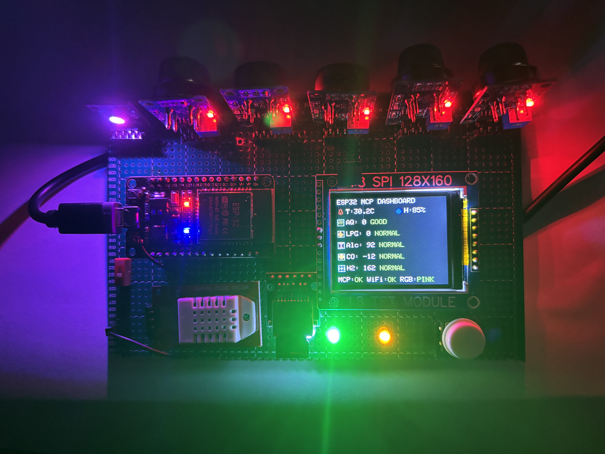
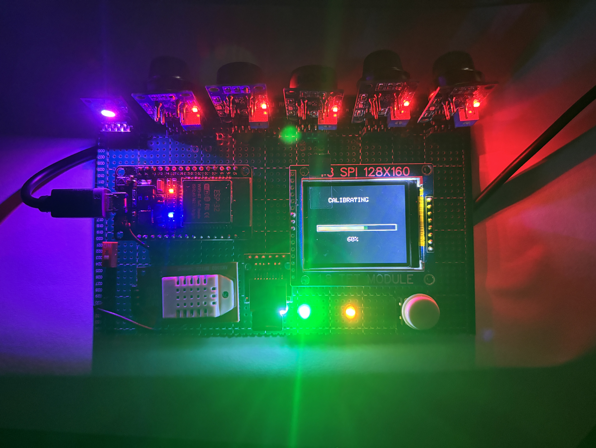
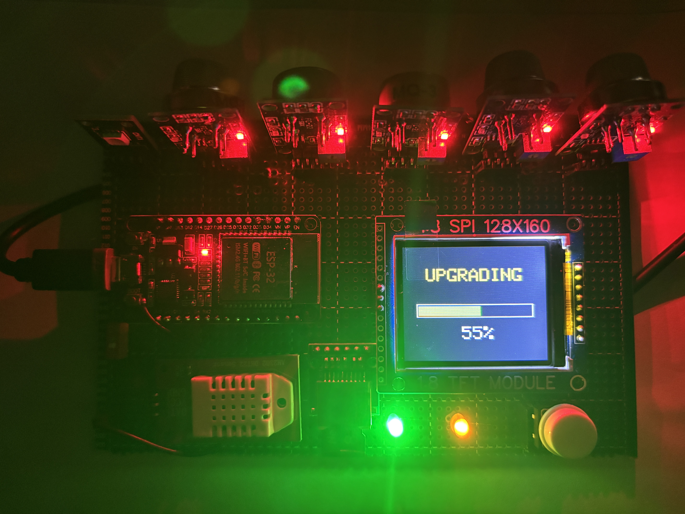

ESP32 MCP DASHBOARD: COMPLETE SYSTEM DOCUMENTATION
Developer: Munna Kumar

1. FIRST-TIME SETUP & WI-FI CONFIGURATION
------------------------------------------------------------
* Captive Portal (Auto-Popup): When powered on for the first time, the device has no saved network credentials. It automatically creates its own Wi-Fi Access Point (Hotspot) named "MCP-ESP32 Setup". On most smartphones and laptops, connecting to this network will automatically trigger a pop-up screen taking you directly to the setup page.
* Manual Web Page Setup: If the setup page does not open automatically, simply remain connected to the hotspot, open any web browser, and type 192.168.4.1 in the address bar.
* Saving Data: On the setup interface, enter your local Wi-Fi SSID, password, and the MCP server URL (e.g., ws://ip:port). Click 'Save', and the ESP32 will reboot, connect to your router, and go online.

2. MULTI-FUNCTION BUTTON OPERATIONS
------------------------------------------------------------

* Single Tap: Instantly logs the current environmental data (temperature, humidity, and all gas sensor readings) to the Micro SD card. You can later insert this SD card into a PC to view the timestamped .txt log files.
* Double Tap: Toggles the TFT display between standard Color mode and a high-contrast Black & White (B&W) mode. Double-tap again to revert.
* 3-Second Press (While Device is On): Triggers the non-blocking "Calibration" process for all MQ gas sensors. This averages the current clean-air readings to set a new baseline for accurate future measurements.
* 3-Second Press (During Boot): Holding the button down while powering on the device initiates a Factory Reset. This completely erases the saved Wi-Fi credentials and MCP settings from memory, forcing the device back into Captive Portal mode.

3. SENSORS, DISPLAY & SD CARD FUNCTIONALITY
------------------------------------------------------------
* Display Visuals: The 1.8-inch TFT display communicates with the ESP32 via the SPI (Serial Peripheral Interface) bus. The system uses a graphics library to render real-time pixel data, updating text, icons, and dynamic status alerts (Good, Warning, Bad) based on sensor thresholds.
* DHT22 (Temperature & Humidity): This sensor uses a single digital pin. It measures the environment using an internal capacitive humidity sensor and a thermistor, transmitting the processed data to the ESP32 as a digital signal.
* MQ Gas Sensors (MQ-135, 6, 3, 9, 8): Each MQ sensor contains a tiny internal heater. When exposed to target gases (LPG, CO, Alcohol, Smoke, H2), the sensor's internal electrical resistance changes. This creates a fluctuating analog voltage that the ESP32 reads and maps to a value between 0 and 4095.
* Micro SD Card Module: Sharing the SPI bus with the display, the SD module handles file storage. When a single-tap log is triggered, the ESP32 syncs with an internet NTP server to get the exact real-world time, creates a new file named with that timestamp, and writes the sensor data to it.

4. FIRMWARE FLASHING VIA MICRO SD CARD (OFFLINE OTA)
------------------------------------------------------------

* How it Works: The system supports offline firmware updates directly from the Micro SD card without needing to connect the ESP32 to a computer.
* The Process: 
  1. Compile your updated Arduino code and export the compiled Binary (.bin) file.
  2. Rename the file to upgrade.bin (or downgrade.bin if rolling back) and copy it to the root of the Micro SD card.
  3. Insert the SD card into the module and power on/reboot the ESP32.
* Visual Feedback & Safety: On boot, the ESP32 will detect the file and automatically begin the flashing process. The TFT display will show "UPGRADING" (or "DOWNGRADING") along with a live progress bar.
* Auto-Rename: Once the flash is 100% successful, the system automatically renames the file to upgrade.done (or downgrade.done). This ensures the device doesn't get stuck in a boot loop by trying to flash the same file again on the next restart. The ESP32 will then automatically reboot with the new software.

5. MCP SERVER, ROBOT CONTROL & LED INDICATORS
------------------------------------------------------------
* MCP Server Connectivity: The ESP32 maintains a persistent WebSocket connection to your MCP server over Wi-Fi. This allows any AI agent, external robot, or remote software connected to that same server to read your sensor data globally in real time.
* RGB LED (Robot Command): If the connected AI or robot sends a JSON command (e.g., {"color":"RED"}), the ESP32 intercepts it and instantly changes the RGB LED color. This serves as a physical indicator that the external AI has received the data and executed an action.
* Flashing Blink LED: A standard LED on the board toggles on and off every 500 milliseconds. This acts as a system "heartbeat," visually confirming that the FreeRTOS main loop is running smoothly and hasn't crashed or frozen.

Requirement Library

1. WebSocketMCP 
2. DHT sensor library 
3. Adafruit GFX Library 
4. Adafruit ST7735 and ST7789 Library 
5. ArduinoJson 
6. Adafruit Unified Sensor

ESP32 DEVKIT V1 Pin Connections

1.8” TFT Display — ST7735

TFT Pin	ESP32 GPIO	Description
VCC	3V3	3.3V Power
GND	GND	Common Ground
CS	GPIO 5	TFT Chip Select
RST	GPIO 14	TFT Reset
D/C	GPIO 12	Data/Command
DIN (MOSI)	GPIO 23	SPI MOSI — Shared with Micro SD
CLK (SCK)	GPIO 18	SPI Clock — Shared with Micro SD
BL	3V3	Backlight

Micro SD Card Module

SD Pin	ESP32 GPIO	Description
VCC	VIN / 5V	5V Power*
GND	GND	Common Ground
MOSI	GPIO 23	SPI MOSI — Shared with TFT
SCK	GPIO 18	SPI Clock — Shared with TFT
MISO	GPIO 19	SPI MISO
CS	GPIO 13	SD Chip Select

* Use 5V only if your SD module has a suitable onboard regulator and level shifting. Verify the specifications of your specific module before connecting it.

Calibration Button

Button Pin	ESP32 GPIO
Terminal 1	GPIO 15
Terminal 2	GND

The button uses the ESP32 internal pull-up configuration.

DHT22 Temperature & Humidity Sensor

DHT22 Pin	ESP32 GPIO	Description
VCC	3V3	3.3V Power
DATA	GPIO 27	Data Signal
GND	GND	Common Ground

MQ Gas Sensors

Sensor	Measurement	Analog Output (A0)
MQ-135	Air Quality	GPIO 34
MQ-6	LPG / Gas	GPIO 35
MQ-3	Alcohol	GPIO 32
MQ-9	Carbon Monoxide (CO)	GPIO 33
MQ-8	Hydrogen (H₂)	GPIO 39 (VN)

MQ Sensor Power

* VCC → VIN / 5V
* GND → Common GND
* A0 → ESP32 ADC input through a suitable voltage divider

A stable external 5V power supply is recommended for the MQ sensors because their heaters can consume significant current.

RGB LED

RGB Pin	ESP32 GPIO	Component
R (Red)	GPIO 4	220Ω resistor
G (Green)	GPIO 25	220Ω resistor
B (Blue)	GPIO 26	220Ω resistor
Common	GND	Common Ground

Status / Blink LED

LED Pin	ESP32 GPIO	Component
Anode (+)	GPIO 2	220Ω resistor
Cathode (-)	GND	Common Ground

⸻

MQ Sensor Analog Voltage Divider

MQ sensor modules can potentially provide an analog output higher than the ESP32 ADC input range. Do not connect a 5V analog signal directly to an ESP32 GPIO.

MQ Sensor A0
     |
     |
    10kΩ
     |
     +-------------> ESP32 ADC GPIO
     |
    20kΩ
     |
    GND

With a 10kΩ / 20kΩ voltage divider:

Vout = Vin × 20kΩ / (10kΩ + 20kΩ)

For a 5V input:

Vout ≈ 3.33V

Since this is slightly above 3.3V, using a divider with additional voltage margin is recommended when the sensor output can reach 5V.

Important: Always verify the maximum A0 output voltage of your specific MQ sensor module before connecting it to the ESP32 ADC.

⸻

SPI Bus Sharing

The TFT display and Micro SD card share the same SPI bus:

* MOSI → GPIO 23
* MISO → GPIO 19
* SCK → GPIO 18
* TFT CS → GPIO 5
* SD CS → GPIO 13

Each SPI device uses its own CS (Chip Select) pin.

Common Ground

All modules must share a common ground:

ESP32 GND → TFT GND → SD GND → DHT22 GND → MQ Sensor GND → RGB GND → LED GND
